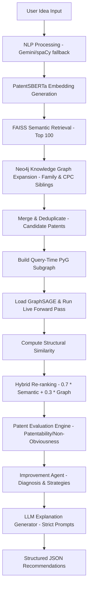

# Developer Context: GNN Inference & Improvement Agent

This document provides a technical overview of two major system restorations and enhancements integrated into the **Graph-Enhanced Patent Intelligence Platform**:
1. **Live Query-Time GNN Inference**: Replaced static/offline GNN score caching with an active GraphSAGE model forward-pass at query time.
2. **Improvement Agent**: Created a deterministic reasoning engine that diagnoses patent idea weaknesses and recommends technical improvements, using an LLM strictly for natural language explanation.

---

## 1. System Pipeline Architecture

The platform operates as a multi-stage retrieval, re-ranking, evaluation, and recommendation pipeline:



---

## 2. Live GNN Inference Engine (`backend/src/gnn/`)

Restored live forward-pass inference on the trained `GraphSAGE` model. The GNN scores are calculated at query time on a dynamic PyTorch Geometric (PyG) subgraph built around FAISS hits and Neo4j expansion neighbors.

### Key Components:
* **[model.py](file:///c:/Users/Lenovo/Documents/Projects/Graph-Enhanced%20Patent%20Intelligence%20Platform/patent-kg/backend/src/gnn/model.py)**: Defines `PatentGraphSAGE`, a 3-layer SAGEConv model with residual connections, mapping 780-dimensional input features (768 SBERTa + 12 metadata dimensions) to a 64-dimensional embedding space.
* **[graph_builder.py](file:///c:/Users/Lenovo/Documents/Projects/Graph-Enhanced%20Patent%20Intelligence%20Platform/patent-kg/backend/src/gnn/graph_builder.py)**: Builds a dynamic `torch_geometric.data.Data` subgraph at query time. One-hot encodes jurisdictions (`EP`, `US`, `WO`) and domains (`AI`, `Automotive`, `Energy`, `IoT`, `Mechanical`, `Medical`), and queries Neo4j for edges based on simple families, CPC sharing, and paper citation relationships.
* **[inference.py](file:///c:/Users/Lenovo/Documents/Projects/Graph-Enhanced%20Patent%20Intelligence%20Platform/patent-kg/backend/src/gnn/inference.py)**: Manages dynamic model weights loading (supporting `gnn_model.pt` or `patent_gnn.pt`) and performs the PyG forward pass.
* **[reranker.py](file:///c:/Users/Lenovo/Documents/Projects/Graph-Enhanced%20Patent%20Intelligence%20Platform/patent-kg/backend/src/gnn/reranker.py)**: Blends semantic similarity and structural graph similarity using a `0.7 * semantic_score + 0.3 * graph_score` formula, tracking the rank-change delta.
* **[scorer.py](file:///c:/Users/Lenovo/Documents/Projects/Graph-Enhanced%20Patent%20Intelligence%20Platform/patent-kg/backend/src/gnn/scorer.py)**: Interfaces between the core retrieval modules and the new live GNN inference pipeline.

---

## 3. Improvement Agent (`backend/src/improvement/`)

The Improvement Agent functions as a deterministic reasoning module. It isolates the diagnosis of overlap and weakness detection from LLM hallucinations. The LLM only explains and communicates the system's deterministic selections.

### Key Components:
* **[config.py](file:///c:/Users/Lenovo/Documents/Projects/Graph-Enhanced%20Patent%20Intelligence%20Platform/patent-kg/backend/src/improvement/config.py)**: Centralizes all hardcoded thresholds (`SEMANTIC_THRESHOLD = 0.70`, `GRAPH_THRESHOLD = 0.75`, `LANDSCAPE_THRESHOLD = 0.50`, etc.) to separate system parameters from logic.
* **[schemas.py](file:///c:/Users/Lenovo/Documents/Projects/Graph-Enhanced%20Patent%20Intelligence%20Platform/patent-kg/backend/src/improvement/schemas.py)**: Defines Pydantic models for inputs and responses. Response matches standard schemas, containing nested `StrategyItem` and `OverlappingPatentItem` lists.
* **[analyzer.py](file:///c:/Users/Lenovo/Documents/Projects/Graph-Enhanced%20Patent%20Intelligence%20Platform/patent-kg/backend/src/improvement/analyzer.py)**: Evaluates semantic/graph similarities, prior art density, and patentability engine scores to flag problems like `high_semantic_overlap`, `high_graph_overlap`, `crowded_domain`, and `low_novelty`.
* **[strategies.py](file:///c:/Users/Lenovo/Documents/Projects/Graph-Enhanced%20Patent%20Intelligence%20Platform/patent-kg/backend/src/improvement/strategies.py)**: Selects domain-aware technical improvements. Maps problems and primary domains into structured strategies (each with `strategy`, `impact` [high/medium/low], and `reason`) and sorts them by impact.
* **[opportunity_finder.py](file:///c:/Users/Lenovo/Documents/Projects/Graph-Enhanced%20Patent%20Intelligence%20Platform/patent-kg/backend/src/improvement/opportunity_finder.py)**: Contains a `DOMAIN_CROSSOVERS` knowledge base matching combinations of primary and adjacent underrepresented domains to concrete, low-density pivot suggestions.
* **[generator.py](file:///c:/Users/Lenovo/Documents/Projects/Graph-Enhanced%20Patent%20Intelligence%20Platform/patent-kg/backend/src/improvement/generator.py)**: Feeds system results to `gemini-2.5-flash` using the `google-genai` SDK. Imposes strict instructions preventing the LLM from inventing recommendations, performing independent reasoning, or introducing new technologies. Falls back to a deterministic markdown template if rate-limited.
* **[agent.py](file:///c:/Users/Lenovo/Documents/Projects/Graph-Enhanced%20Patent%20Intelligence%20Platform/patent-kg/backend/src/improvement/agent.py)**: Master orchestrator class `ImprovementAgent`.

---

## 4. FastAPI Router Integration

Registered the `/api/improve` router in **[main.py](file:///c:/Users/Lenovo/Documents/Projects/Graph-Enhanced%20Patent%20Intelligence%20Platform/patent-kg/backend/api/main.py)** and implemented routing in **[improve.py](file:///c:/Users/Lenovo/Documents/Projects/Graph-Enhanced%20Patent%20Intelligence%20Platform/patent-kg/backend/api/routers/improve.py)**:
```python
@router.post("/improve", response_model=ImprovementResponse)
async def improve_idea(req: ImprovementRequest):
    # Dynamically computes pipeline_result and evaluation_result on-the-fly 
    # if missing, then orchestrates the ImprovementAgent.
```

---

## 5. Verification & Testing

Both modules include comprehensive test suites in the `tests/` directory:

### GNN Inference Tests
Verify PyG Data loading, feature shape correctness `[N, 780]`, model forward pass execution, and hybrid re-ranking:
```powershell
.\venv\Scripts\python.exe -m unittest tests/test_gnn.py
```

### Improvement Agent Tests
Verify threshold analyzers, domain-specific strategy mappings, opportunity finder crossovers, API endpoint responses, and mock TestClient execution:
```powershell
.\venv\Scripts\python.exe -m unittest tests/test_improvement.py
```
