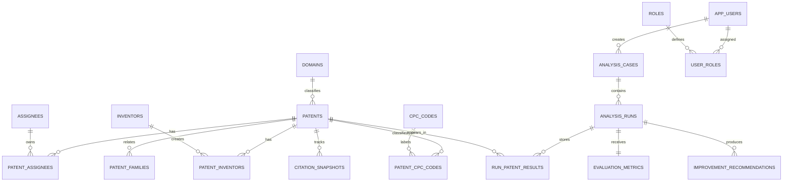

# Graph-Enhanced Patent Intelligence Platform
## Complete Project Technical Manual & DBMS Laboratory Alignment Report

**Course Code**: CD252IA  
**Course Title**: Database Management Systems (Theory and Lab)  
**Academic Level**: Semester V (Common to CS & IS, AI, CD)  
**Evaluation Target**: Lab Mini-Project Report, End-Semester Practical Examination (SEE), and Viva Voce  

---

## Table of Contents
1. [Project Overview, Motivation & Industrial Scope](#1-project-overview-motivation--industrial-scope)
2. [End-to-End System Pipeline Architecture](#2-end-to-end-system-pipeline-architecture)
3. [Component Deep Dive](#3-component-deep-dive)
   - 3.1. [Data Engineering & ETL Lineage](#31-data-engineering--etl-lineage)
   - 3.2. [Hybrid NLP Processing Layer](#32-hybrid-nlp-processing-layer)
   - 3.3. [Dense Semantic Retrieval (FAISS)](#33-dense-semantic-retrieval-faiss)
   - 3.4. [Knowledge Graph Expansion (Neo4j)](#34-knowledge-graph-expansion-neo4j)
   - 3.5. [Live Query-Time GNN Inference & Hybrid Re-Ranking](#35-live-query-time-gnn-inference--hybrid-re-ranking)
   - 3.6. [Multi-Dimensional Patentability Evaluation Engine](#36-multi-dimensional-patentability-evaluation-engine)
   - 3.7. [Deterministic Improvement Agent](#37-deterministic-improvement-agent)
   - 3.8. [Frontend User Interface & Visualizations](#38-frontend-user-interface--visualizations)
4. [DBMS Laboratory Component (Part – A) Alignment Matrix](#4-dbms-laboratory-component-part--a-alignment-matrix)
5. [Conceptual Data Modeling (ER/EER Design)](#5-conceptual-data-modeling-ereer-design)
6. [Relational Model, Normalization & 3NF Proof](#6-relational-model-normalization--3nf-proof)
7. [Three-Schema Database Architecture](#7-three-schema-database-architecture)
8. [Relational Algebra Formulations](#8-relational-algebra-formulations)
9. [SQL Implementation Portfolio (DDL, Views, Complex Queries)](#9-sql-implementation-portfolio-ddl-views-complex-queries)
10. [Database Security & Role-Based Access Control (RBAC)](#10-database-security--role-based-access-control-rbac)
11. [Transaction Processing, ACID & Concurrency Control](#11-transaction-processing-acid--concurrency-control)
12. [Recent Trends (AI/ML/NLP) & Societal Concerns (Section 3 Indian Patent Act)](#12-recent-trends-aimlnlp--societal-concerns-section-3-indian-patent-act)
13. [Deployment, Execution Runbook & Verification](#13-deployment-execution-runbook--verification)
14. [Examiner Viva Voce Q&A Cheat Sheet](#14-examiner-viva-voce-qa-cheat-sheet)

---

## 1. Project Overview, Motivation & Industrial Scope

### 1.1. Problem Statement
Every year, over 3.4 million patent applications are filed globally. Conducting Prior Art Search, Freedom-to-Operate (FTO) analysis, and patentability evaluation are critical for R&D organizations, universities, startups, and patent attorneys. However, current patent research faces three massive roadblocks:
1. **Semantic & Terminology Mismatch**: Patent drafters intentionally use broad, obfuscated, or legalistic jargon (e.g., describing a smartphone screen as a *"plurality of touch-sensitive visual output transducers"*) that defeats standard keyword searches.
2. **International Citation Blind Spots**: Inventions filed in multiple global patent offices (USPTO, EPO, JPO, CNIPA, WIPO) have divergent texts, languages, and drafting styles. A text-only search completely misses structurally equivalent foreign family members.
3. **Absence of Actionable Feasibility & Improvement Insights**: Legacy databases (Google Patents, Espacenet, Lens.org) merely list candidate documents. They do not calculate statutory patentability metrics (Novelty, Non-Obviousness, Landscape Crowding, Claim Breadth) or provide technical engineering pivots to help inventors design around existing patents.

### 1.2. The Solution: Graph-Enhanced Patent Intelligence Platform
This project provides a full-stack, enterprise-grade AI decision-support platform. A user submits an invention idea; the platform cleans and semantically parses the idea, performs dense vector search over 215,000+ patents, expands the candidate set through an international Knowledge Graph, executes query-time Graph Neural Network (GraphSAGE) re-ranking, evaluates patentability across five statutory dimensions, and deterministically generates architectural improvement recommendations.

---

## 2. End-to-End System Pipeline Architecture

The overall system architecture orchestrates relational storage, graph traversals, vector indexing, neural network inference, and LLM explanation into a unified workflow:

```
+--------------------------------------------------------------------------------------------------+
|                                    React / Vite User Interface                                   |
+--------------------------------------------------------------------------------------------------+
          |  (Idea Text, top_k, gnn_mode)                             ^ (JSON Pipeline Results)
          v                                                           |
+--------------------------------------------------------------------------------------------------+
|                                       FastAPI Backend Layer                                      |
+--------------------------------------------------------------------------------------------------+
  |
  |-- Step 1: NLP Processing Layer (Google Gemini 2.5-flash with spaCy en_core_web_sm fallback)
  |      --> Outputs clean_text, technical entities, ranked keywords
  |
  |-- Step 2: Dense Semantic Vector Retrieval (FAISS)
  |      --> SentenceTransformer (PatentSBERTa 768-d / all-MiniLM-L6-v2 384-d)
  |      --> L2-normalized inner product cosine similarity search over patents.index
  |
  |-- Step 3: Structural Knowledge Graph Expansion (Neo4j)
  |      --> Explores Simple/Extended International Families & CPC Technology Siblings
  |      --> Optimized Cypher query with global 100-patent candidate cap
  |      --> Assigns provenance: "faiss" | "kg_family" | "kg_cpc"
  |
  |-- Step 4: Dynamic Query-Time GNN Inference (PyTorch Geometric GraphSAGE)
  |      --> Dynamic PyG graph construction: 780-d node features (768 embedding + 12 metadata)
  |      --> 3-layer residual GraphSAGE forward pass for novelty or graph similarity
  |      --> Hybrid Re-ranking: 0.70 * semantic_score + 0.30 * graph_score
  |
  |-- Step 5: Patentability Evaluation Engine
  |      --> Novelty (FAISS isolation + GNN novelty)
  |      --> Non-Obviousness (8 sub-scorers including combination difficulty & cross-domain breadth)
  |      --> Landscape Density & Assignee Concentration
  |      --> Claim Breadth & Filing Timing
  |      --> Section 3 Indian Patent Act Compliance & Technical Depth Damping
  |
  |-- Step 6: Deterministic Improvement Agent
  |      --> Rule-based weakness detection (high overlap, crowded domain, low novelty)
  |      --> Architectural strategy selection & Cross-Domain Opportunity Matrix
  |      --> Gemini LLM strictly explains selections without hallucinations
  |
  v-- Step 7: Relational Case & Run Persistence (MySQL 8.4 via SQLAlchemy / PyMySQL)
         --> Atomic ACID storage of Analysis Case, Run details, Ranked Hits, and Metric Scores
```

---

## 3. Component Deep Dive

### 3.1. Data Engineering & ETL Lineage
The dataset encompasses six high-technology sectors sourced from Lens.org exports: **Artificial Intelligence (AI)**, **Automotive**, **Energy**, **Internet of Things (IoT)**, **Mechanical**, and **Medical**.

```
data/raw/*.csv (6 domain exports)
     │
     ▼ (backend/scripts/data/process_patents.py)
data/processed/*.csv
     ├── patents.csv               (58,428 unique patents with title, abstract, year, domain)
     ├── assignees.csv             (71,088 mappings to corporate assignees)
     ├── inventors.csv             (187,563 mappings to individual inventors)
     ├── classifications.csv       (1,020,178 CPC classification code mappings)
     ├── patent_families.csv       (1,433,689 international simple & extended family edges)
     ├── citations_metadata.csv    (58,428 citation count statistics)
     └── npl_metadata.csv          (334,566 non-patent literature / scientific papers)
          │
          ├──► bootstrap_mysql.py       ──► MySQL 3NF Relational Database
          ├──► sync_mysql_to_neo4j.py   ──► Neo4j Graph Database (216k nodes, 2.67M edges)
          └──► build_faiss_index.py     ──► FAISS Vector Store (patents.index, 768-d vectors)
```

### 3.2. Hybrid NLP Processing Layer (`backend/src/nlp/`)
- **Preprocessing**: Cleans input text, handles casing, strips noise, and normalizes legal patent boilerplate.
- **LLM Entity & Keyword Extraction**: Calls Gemini 2.5 (`google.genai` SDK) using structured prompt templates to extract clean core technical text, key domain entities (algorithms, hardware components, biochemical targets), and 3 to 6 normalized keywords.
- **Output Validation & spaCy Fallback**: Validates the JSON schema of the LLM response. If the API key is missing or validation fails, it seamlessly switches to a local spaCy (`en_core_web_sm`) pipeline for part-of-speech tagging and noun-phrase extraction.
- **Corpus-Query Symmetry**: Guarantees that query strings embedded by SentenceTransformer match the exact indexing strategy used during corpus ingestion (`title + ". " + abstract`).

### 3.3. Dense Semantic Retrieval (FAISS) (`backend/src/integration/pipeline.py`)
- Employs **PatentSBERTa** (`AI-Growth-Lab/PatentSBERTa`), a 768-dimensional transformer fine-tuned on patent claims and technical disclosures.
- Normalizes all vectors using L2 normalization (`faiss.normalize_L2`), enabling inner-product (`IndexFlatIP`) to compute exact **Cosine Similarity**:
  $$\text{Cosine Similarity}(u, v) = \frac{u \cdot v}{\|u\|_2 \|v\|_2} = u_{\text{norm}} \cdot v_{\text{norm}}$$
- Sub-millisecond retrieval of the top-$k$ nearest neighbors across 58,428 core patents.

### 3.4. Knowledge Graph Expansion (Neo4j) (`backend/src/kg/`)
- The Neo4j graph contains **215,985 Patent nodes** (58,428 core patents + 157,557 international stub patents representing European, Japanese, and PCT filings of the same inventions) and **2.67 million edges**.
- **Edge Types**:
  - `(:Company)-[:OWNS]->(:Patent)`
  - `(:Inventor)-[:INVENTED]->(:Patent)`
  - `(:Patent)-[:HAS_CPC]->(:CPCCode)`
  - `(:Patent)-[:SIMPLE_FAMILY_MEMBER]->(:Patent)`
  - `(:Patent)-[:EXTENDED_FAMILY_MEMBER]->(:Patent)`
  - `(:Patent)-[:CITES_PAPER]->(:Paper)`
- **Expansion Logic**: When FAISS retrieves candidate patents, Neo4j is queried to retrieve their international family members and sibling patents in the same CPC technology groups.
- **Query Optimization**: Traversal is executed in Cypher with a **global 100-patent cap** sliced directly within Neo4j, reducing query latency by over 13x. Newly discovered patents are embedded on the fly and given a `semantic_score`.

### 3.5. Live Query-Time GNN Inference & Hybrid Re-Ranking (`backend/src/gnn/`)
Unlike static systems that pre-compute node scores, this platform constructs a dynamic PyTorch Geometric (PyG) graph at query time:
- **Node Feature Vector (780 dimensions)**:
  - 768 dimensions: SBERTa semantic text embedding.
  - 12 dimensions: One-hot encoded metadata (Jurisdictions: `EP`, `US`, `WO`; Domains: `AI`, `Automotive`, `Energy`, `IoT`, `Mechanical`, `Medical`).
- **Model Architecture (`PatentGraphSAGE`)**:
  - 3-layer `SAGEConv` with residual skip connections to eliminate graph oversmoothing.
  - Layer dimensions: $780 \to 128 \to 64 \to 32$.
- **Operational Modes**:
  - `novelty`: Scores structural isolation based on recency, low citation crowding, and compact family size:
    $$\text{Target Novelty} = 0.30 \times \text{Recency} + 0.40 \times (1 - \log(\text{Citations})) + 0.30 \times (1 - \log(\text{Family Size}))$$
  - `graph_sim`: Computes live structural cosine similarity between GraphSAGE node embeddings.
- **Hybrid Re-ranking Formula**:
  $$\text{Combined Score} = 0.70 \times \text{semantic\_score} + 0.30 \times \text{graph\_score}$$
  Tracks rank delta ($\Delta \text{rank}$) showing positions gained or lost due to graph structural insights.

### 3.6. Multi-Dimensional Patentability Evaluation Engine (`backend/src/evaluation/`)
Evaluates an invention across five statutory dimensions using 14 sub-scorers:
1. **Novelty Score**: Weighted blend of FAISS semantic isolation (60%) and GNN structural novelty (40%).
2. **Non-Obviousness (Inventive Step)**:
   - *Combination Difficulty*: Tree distance between CPC codes and shortest path distance in Neo4j.
   - *Motivation to Combine*: Cross-citation density between candidate clusters.
   - *Cross-Domain Novelty*: Spread of concepts across distinct CPC sections (A through H).
   - *Solution Reconstruction*: LLM test assessing whether prior art readily suggests the claimed combination.
   - *Citation Isolation, Long-Felt Need, Teaching Away, and Unexpected Effects*.
3. **Landscape Crowding**: Assignee concentration (Herfindahl-Hirschman Index proxy) and active filing density.
4. **Claim Breadth**: Hierarchical depth and uniqueness of CPC codes.
5. **Technology Timing**: Recency and velocity of prior filings.
- **Section 3 of the Indian Patent Act**: Rule-based screening flagging non-patentable subject matter:
  - *Section 3(d)*: New use of known substance without enhanced therapeutic efficacy.
  - *Section 3(i)*: Medical diagnostic methods on human bodies.
  - *Section 3(k)*: Mathematical methods, business methods, or computer programs *per se*.
- **Technical Depth Damping**: Multiplier that dampens scores if the input text is too brief or lacks specific technical mechanisms.

### 3.7. Deterministic Improvement Agent (`backend/src/improvement/`)
- Operates on a **deterministic-first** principle to eliminate hallucination risks in legal/technical recommendations.
- Compares pipeline scores against centralized thresholds (`SEMANTIC_THRESHOLD = 0.70`, `GRAPH_THRESHOLD = 0.75`, `LANDSCAPE_THRESHOLD = 0.50`).
- Diagnoses specific weaknesses: `high_semantic_overlap`, `high_graph_overlap`, `crowded_domain`, `low_novelty`.
- Maps weaknesses to domain-specific architectural strategies (e.g., edge quantization for AI, ultra-low power wake-up for IoT, differential capacitive sensing for Medical).
- Identifies **Cross-Domain Technology Crossovers** using a pre-defined opportunity matrix (e.g., integrating automotive CAN bus protocols into medical robotics).
- Uses Gemini strictly to draft natural language explanations for the deterministically chosen strategies.

### 3.8. Frontend User Interface & Visualizations (`frontend/src/`)
Built with React 18, Vite, TypeScript, Tailwind CSS, React Flow, and Zustand:
- **Idea Input Page (`/analyze`)**: Clean input form for idea text, top-k slider, and GNN mode selection.
- **Pipeline Progress Page (`/pipeline`)**: Step-by-step visual animation tracking execution stages.
- **NLP Results Page (`/results/nlp`)**: Displays cleaned text, extracted entities, and technical keywords.
- **Patent Retrieval Page (`/results/patents`)**: Interactive table showing ranked hits, provenance badges (`faiss`, `kg_family`, `kg_cpc`), semantic scores, and rank change deltas.
- **Knowledge Graph Visualization (`/results/graph`)**: Powered by **React Flow**, rendering interactive node-link diagrams of patents, assignees, inventors, and CPC codes.
- **GNN Analysis Page (`/results/gnn`)**: Visual bar charts and interactive sliders allowing real-time adjustment of semantic vs. graph blend weights in the browser.
- **Evaluation Dashboard (`/results/evaluation`)**: Interactive radar chart covering all 5 patentability dimensions, Indian Section 3 risk flags, and confidence-dampened verdicts.
- **Improvement Agent Page (`/results/improvements`)**: Displays diagnosed weaknesses, prioritized architectural strategies, and cross-domain pivot recommendations.
- **Case History Page (`/results/cases`)**: Persistent case management interface backed directly by MySQL.

---

## 4. DBMS Laboratory Component (Part – A) Alignment Matrix

The table below maps the Semester V DBMS Laboratory guidelines directly to our repository:

| Laboratory Component Task | Implementation in Platform | Codebase Reference |
|---|---|---|
| **Domain Knowledge & Data Requirements** | Complete patent analytics domain model covering patents, assignees, inventors, CPC codes, families, citations, cases, runs, and metric audits. | • [`docs/database/README.md`](./database/README.md)<br>• [`docs/reference/knowledge-graph.md`](./reference/knowledge-graph.md) |
| **Integrated Database Solution (SQL + NoSQL)** | **Multi-Model Polyglot Architecture**:<br>• **SQL**: MySQL 8.4 (3NF source of truth).<br>• **NoSQL**: Neo4j 5.x (Graph traversal) & FAISS (Vector store). | • [`docker-compose.yml`](../docker-compose.yml)<br>• [`backend/scripts/database/sync_mysql_to_neo4j.py`](../backend/scripts/database/sync_mysql_to_neo4j.py) |
| **Normalization up to 3NF** | Complete mathematical proof demonstrating 1NF, 2NF, and 3NF compliance. Decomposition of multi-valued attributes and removal of transitive dependencies. | • [`docs/database/normalization.md`](./database/normalization.md)<br>• [`database/sql/01_schema.sql`](../database/sql/01_schema.sql) |
| **Database Security (RBAC)** | Role-Based Access Control enforcing Least Privilege across `admin`, `app_user`, and `report_reader` accounts with restricted `GRANT` statements. | • [`database/sql/03_roles.sql`](../database/sql/03_roles.sql) |
| **Documentation & Technical Report** | Full ER diagrams (SVG and Mermaid), normalization proofs, SQL query portfolio, and system execution runbooks. | • [`docs/database/er-model.svg`](./database/er-model.svg)<br>• [`docs/architecture.md`](./architecture.md) |
| **Recent Trends (AI / ML / NLP)** | Integration of Google Gemini 2.5, spaCy, PatentSBERTa embeddings, and PyTorch Geometric GraphSAGE Neural Networks. | • [`backend/src/nlp/`](../backend/src/nlp/)<br>• [`backend/src/gnn/`](../backend/src/gnn/) |
| **Societal Concerns Addressed** | Democratizing patent search for independent inventors and automated compliance screening under **Section 3 of the Indian Patent Act**. | • [`backend/src/evaluation/india_eligibility.py`](../backend/src/evaluation/india_eligibility.py) |
| **Frontend & Dynamic Database Programming** | React 18 / Vite frontend communicating via FastAPI with SQLAlchemy ORM and parameterized PyMySQL dynamic SQL. | • [`frontend/src/`](../frontend/src/)<br>• [`backend/src/persistence/`](../backend/src/persistence/) |

---

## 5. Conceptual Data Modeling (ER/EER Design)

### 5.1. Entity Classifications
1. **Strong Entities**:
   - `DOMAINS` (`domain_id`, name)
   - `PATENTS` (`patent_id`, title, abstract, publication_year, legal_status, cited_by_patent_count, url, domain_id)
   - `ASSIGNEES` (`assignee_id`, name)
   - `INVENTORS` (`inventor_id`, name)
   - `CPC_CODES` (`cpc_code`, section, description)
   - `NPL_REFERENCES` (`npl_id`, citation, normalized_key)
   - `APP_USERS` (`user_id`, email, display_name, is_active)
   - `ROLES` (`role_id`, name)
   - `ANALYSIS_CASES` (`case_id`, owner_user_id, title, idea_text, status)
2. **Weak / Associative Entities**:
   - `ANALYSIS_RUNS` (identifying relationship with `ANALYSIS_CASES`)
   - `RUN_PATENT_RESULTS` (associative junction between `ANALYSIS_RUNS` and `PATENTS`)
   - `EVALUATION_METRICS` (1:1 dependent entity on `ANALYSIS_RUNS`)
   - `IMPROVEMENT_RECOMMENDATIONS` (1:N dependent entity on `ANALYSIS_RUNS`)
   - `CITATION_SNAPSHOTS` (historical temporal entity dependent on `PATENTS`)
   - `PATENT_ASSIGNEES`, `PATENT_INVENTORS`, `PATENT_CPC_CODES`, `PATENT_FAMILIES`, `PATENT_NPL_REFERENCES`

### 5.2. Cardinality & Relationship Constraints
- `PATENTS` to `ASSIGNEES`: Many-to-Many ($M:N$) via `PATENT_ASSIGNEES`.
- `PATENTS` to `INVENTORS`: Many-to-Many ($M:N$) via `PATENT_INVENTORS`.
- `PATENTS` to `CPC_CODES`: Many-to-Many ($M:N$) via `PATENT_CPC_CODES`.
- `PATENTS` to `PATENTS` (Families): Recursive Many-to-Many ($M:N$) via `PATENT_FAMILIES`.
- `ANALYSIS_CASES` to `ANALYSIS_RUNS`: One-to-Many ($1:N$). Total participation of `ANALYSIS_RUNS`.
- `ANALYSIS_RUNS` to `EVALUATION_METRICS`: One-to-One ($1:1$). Mandatory participation on completed runs.

### 5.3. Entity-Relationship Diagram (Mermaid)



---

## 6. Relational Model, Normalization & 3NF Proof

### 6.1. Functional Dependencies ($\text{FDs}$)
- $\text{FD}_1$: $\text{patent\_id} \rightarrow \text{title}, \text{abstract}, \text{publication\_year}, \text{legal\_status}, \text{cited\_by\_patent\_count}, \text{url}, \text{domain\_id}$
- $\text{FD}_2$: $\text{domain\_id} \rightarrow \text{name}$
- $\text{FD}_3$: $\text{assignee\_id} \rightarrow \text{name}$
- $\text{FD}_4$: $\text{inventor\_id} \rightarrow \text{name}$
- $\text{FD}_5$: $\text{cpc\_code} \rightarrow \text{section}, \text{description}$
- $\text{FD}_6$: $\text{case\_id} \rightarrow \text{owner\_user\_id}, \text{title}, \text{idea\_text}, \text{status}, \text{created\_at}$
- $\text{FD}_7$: $\text{run\_id} \rightarrow \text{case\_id}, \text{query\_id}, \text{gnn\_mode}, \text{top\_k}, \text{run\_status}, \text{started\_at}$
- $\text{FD}_8$: $(\text{run\_id}, \text{patent\_id}) \rightarrow \text{rank\_position}, \text{source}, \text{expansion\_type}, \text{semantic\_score}, \text{graph\_score}, \text{combined\_score}, \text{novelty\_score}$

### 6.2. Mathematical Proof of Normal Forms

#### 1. First Normal Form (1NF)
- **Criterion**: Every attribute contains only atomic (indivisible) values; no multivalued attributes or repeating groups.
- **Raw Export Violation**: In source exports, inventors, assignees, and classifications exist as delimited strings (e.g., `"G06N 3/08; G06F 18/24"`).
- **Resolution**: Decomposed into separate associative tables (`PATENT_CPC_CODES`, `PATENT_ASSIGNEES`, `PATENT_INVENTORS`) where every cell holds exactly one atomic value. All tables have explicit primary keys.

#### 2. Second Normal Form (2NF)
- **Criterion**: Must be in 1NF and contain **no partial dependencies** (no non-prime attribute may depend on a proper subset of any composite candidate key).
- **Validation**:
  - In `RUN_PATENT_RESULTS`, the candidate key is composite: $(\text{run\_id}, \text{patent\_id})$. The non-prime attributes (`semantic_score`, `graph_score`, `rank_position`) depend on both the patent and the specific run in which it was retrieved. Neither $\text{run\_id}$ nor $\text{patent\_id}$ alone can determine the score.
  - In `PATENT_CPC_CODES(patent_id, cpc_code)`, there are no non-prime attributes.
  - Therefore, all relations satisfy 2NF.

#### 3. Third Normal Form (3NF)
- **Criterion**: Must be in 2NF and contain **no transitive dependencies** (for every non-trivial functional dependency $X \rightarrow Y$, either $X$ is a superkey or $Y$ is a prime attribute).
- **Validation**:
  - In unnormalized patents, storing domain name alongside `domain_id` creates a transitive dependency: $\text{patent\_id} \rightarrow \text{domain\_id} \rightarrow \text{name}$. We decomposed this by creating the independent `DOMAINS` table.
  - In `PATENTS`, all descriptive attributes depend strictly and directly on the primary key `patent_id`.
  - In `CPC_CODES`, technology descriptions depend directly on `cpc_code`.
  - Therefore, the schema is strictly in **3NF**.

#### 4. Boyce-Codd Normal Form (BCNF)
- For every functional dependency $X \rightarrow Y$, the determinant $X$ is a superkey. In all decomposed relations, determinants (`patent_id`, `assignee_id`, `cpc_code`, `case_id`, `run_id`) are candidate keys. Thus, the schema satisfies BCNF.

---

## 7. Three-Schema Database Architecture

The platform strictly exemplifies the **ANSI/SPARC Three-Schema Architecture**:

```
[ External Level ]   React Frontend Pages   |  Reporting Views (vw_run_comprehensive_summary)
                                       |
                           (Logical Data Independence)
                                       v
[ Conceptual Level ] Canonical 3NF Relational Schema (patents, assignees, cases, runs)
                                       |
                          (Physical Data Independence)
                                       v
[ Internal Level ]   InnoDB B+ Tree Indexes | Foreign Keys | Disk Files | FAISS Vectors
```

- **Logical Data Independence**: Adding new evaluation metrics or expanding reporting views does not require changing the underlying conceptual table structures or existing application queries.
- **Physical Data Independence**: Creating secondary indexes (e.g., `ix_patent_year_domain`) or altering InnoDB buffer pool sizes does not break the conceptual schema or application code.

---

## 8. Relational Algebra Formulations

The core queries in this platform are formally expressed in Relational Algebra:

### 1. Selection & Projection ($\sigma, \pi$)
Retrieve patent IDs, titles, and publication years in the 'AI' domain published from 2021 onwards:
$$\pi_{\text{patent\_id, title, publication\_year}} \left( \sigma_{\text{DOMAINS.name} = \text{'AI'} \land \text{publication\_year} \ge 2021} (\text{PATENTS} \bowtie_{\text{PATENTS.domain\_id} = \text{DOMAINS.domain\_id}} \text{DOMAINS}) \right)$$

### 2. Natural Join & Aggregation ($\bowtie, \gamma$)
Calculate the total number of patents owned by each corporate assignee:
$$\gamma_{\text{assignee\_id, name}; \text{COUNT}(\text{patent\_id}) \to \text{total\_patents}} (\text{ASSIGNEES} \bowtie \text{PATENT\_ASSIGNEES})$$

### 3. Relational Division ($\div$) — Core Syllabus Requirement
Find assignees that hold patents across **all** designated CPC sections (e.g., sections $\{'G', 'H', 'Y'\}$):
$$\text{AssigneeSections}(\text{assignee\_id}, \text{section}) \div \text{TargetSections}(\text{section})$$
Implemented in SQL query $Q_5$ using `GROUP BY` and `HAVING COUNT(DISTINCT ...)`:
```sql
SELECT a.assignee_id, a.name
FROM assignees a
JOIN patent_assignees pa ON a.assignee_id = pa.assignee_id
JOIN patent_cpc_codes pc ON pa.patent_id = pc.patent_id
JOIN cpc_codes c ON pc.cpc_code = c.cpc_code
WHERE c.section IN ('G', 'H', 'Y')
GROUP BY a.assignee_id, a.name
HAVING COUNT(DISTINCT c.section) = 3;
```

---

## 9. SQL Implementation Portfolio (DDL, Views, Complex Queries)

The complete SQL scripts live in [`database/sql/`](../database/sql/):

### 9.1. DDL & Integrity Constraints ([`01_schema.sql`](../database/sql/01_schema.sql))
- Primary Keys and Foreign Keys with `ON DELETE CASCADE` and `ON DELETE SET NULL`.
- `CHECK` Constraints:
  - `ck_patent_year`: `CHECK (publication_year IS NULL OR publication_year BETWEEN 1800 AND 2200)`
  - `ck_patent_citations`: `CHECK (cited_by_patent_count >= 0)`
  - `ck_run_top_k`: `CHECK (top_k BETWEEN 1 AND 100)`
  - `ck_family_distinct`: `CHECK (patent_id <> related_patent_id)`
  - `ck_run_rank`: `CHECK (rank_position > 0)`

### 9.2. Reporting Views ([`02_reporting_views.sql`](../database/sql/02_reporting_views.sql))
- `vw_run_comprehensive_summary`: Computes candidate counts, average semantic scores, and execution timestamps per analysis run.
- `vw_cpc_section_coverage`: Aggregates the spread of candidate patents across CPC technology sections.
- `vw_patent_retrieval_catalogue`: Denormalizes patents with concatenated assignees and CPC tags for rapid display.

### 9.3. Complex SQL Query Portfolio ([`04_query_portfolio.sql`](../database/sql/04_query_portfolio.sql))
Contains 8 advanced queries covering all syllabus requirements:
1. **$Q_1$ (Inner Joins)**: Full patent attribution joining patents, domains, assignees, and inventors.
2. **$Q_2$ (Outer Joins)**: Left outer join identifying unassigned or unclassified patents.
3. **$Q_3$ (Aggregation & HAVING)**: Assignees with high average citations filtered via `HAVING COUNT(*) >= 5`.
4. **$Q_4$ (Correlated Subquery)**: Isolates candidate patents using `NOT EXISTS` to detect missing family expansions.
5. **$Q_5$ (Relational Division)**: Universal quantification ($\forall$) finding assignees covering all required CPC sections.
6. **$Q_6$ (Window Functions)**: `DENSE_RANK() OVER (PARTITION BY ... ORDER BY ...)` ranking patents by citations within each domain.
7. **$Q_7$ (Batch UPDATE)**: Conditional mathematical rescaling of scores.
8. **$Q_8$ (Cascading DELETE)**: Clean removal of archived cases and all dependent runs, results, and metrics.

---

## 10. Database Security & Role-Based Access Control (RBAC)

Documented in [`database/sql/03_roles.sql`](../database/sql/03_roles.sql), the system enforces the **Principle of Least Privilege**:

```
[ DBA / Root Admin ] ─── Full DDL, DCL, and Administrative Privileges
          │
          ├──► role_patent_app    ──► Granted to FastAPI Backend
          │                           • DML: SELECT, INSERT, UPDATE, DELETE on application tables
          │                           • Explicitly DENIED DDL (cannot drop tables or alter schema)
          │
          └──► role_patent_reader ──► Granted to Analysts & Auditors
                                      • Read-only: SELECT on designated reporting views (vw_*)
                                      • Masked access: Cannot query raw patent text or user tables
```

---

## 11. Transaction Processing, ACID & Concurrency Control

### 11.1. ACID Implementation
All pipeline persistence operations in [`backend/src/persistence/analysis_store.py`](../backend/src/persistence/analysis_store.py) execute within atomic SQLAlchemy session blocks:

```python
with session_scope() as session:
    # 1. Update run record
    run.run_status = "completed"
    run.completed_at = datetime.utcnow()
    
    # 2. Bulk insert top-k candidate hits
    session.add_all(result_rows)
    
    # 3. Store evaluation metrics and recommendations
    session.add(metric_row)
    session.add_all(recommendation_rows)
    # ATOMIC COMMIT: If an error occurs, the entire block rolls back
```

- **Atomicity**: Either all run results, metrics, and recommendations are committed, or the database rolls back to the previous state.
- **Consistency**: Enforced through foreign keys, domain `CHECK` constraints, and unique rank constraints (`uq_run_rank`).
- **Isolation**: Handled by InnoDB using **Repeatable Read** and Multi-Version Concurrency Control (MVCC), preventing dirty reads and non-repeatable reads.
- **Durability**: Changes are committed to the InnoDB write-ahead redo log (`ib_logfile`), guaranteeing recovery across power failures.

### 11.2. Two-Phase Locking (2PL)
- InnoDB automatically applies **Strict Two-Phase Locking (Strict 2PL)** at the row level.
- **Growing Phase**: Exclusive locks are acquired when inserting or updating runs and results.
- **Shrinking Phase**: Locks are held until the explicit transaction commit or rollback, guaranteeing serializable execution and eliminating cascading aborts.

---

## 12. Recent Trends (AI/ML/NLP) & Societal Concerns (Section 3 Indian Patent Act)

### Recent Trends:
- **NLP & LLMs**: Google Gemini 2.5 and spaCy for structured query transformation.
- **Dense Vector Embeddings**: Domain-specific PatentSBERTa transformer embeddings in FAISS.
- **Graph Neural Networks (GNN)**: 3-layer GraphSAGE using PyTorch Geometric for query-time topological re-ranking.

### Societal & Ethical Concerns:
- **Democratizing Patent Intelligence**: Commercial patent tools (Derwent, PatSnap) cost \$10,000+ per year, disadvantaging independent inventors, startups, and university labs. This platform provides open-access patent feasibility assessment.
- **Section 3 of the Indian Patent Act**: Automates compliance screening against non-patentable subject matter:
  - *Section 3(d)*: Prevents patent thicketing and evergreen pharmaceutical monopolies.
  - *Section 3(i)*: Safeguards public health by restricting patents on human medical diagnostic methods.
  - *Section 3(k)*: Prevents monopolization of mathematical algorithms and software *per se*.

---

## 13. Deployment, Execution Runbook & Verification

### Step 1: Start Database Containers
```bash
docker compose up -d mysql neo4j
```

### Step 2: Initialize Relational Database & Ingest Data
```bash
cd backend
python scripts/database/bootstrap_mysql.py
python scripts/database/sync_mysql_to_neo4j.py
```

### Step 3: Run Database Contract Verification Tests
```bash
python -m unittest ../tests/test_persistence_contract.py
```

### Step 4: Launch FastAPI Server
```bash
python run_api.py
```
*API Swagger Documentation*: `http://127.0.0.1:8000/docs`

### Step 5: Launch React Frontend
```bash
cd ../frontend
npm install
npm run dev
```
*Web Application*: `http://localhost:5173/`

---

## 14. Examiner Viva Voce Q&A Cheat Sheet

**Q1: Why is this considered an "Integrated Database Solution"?**  
> *Answer*: "The platform combines a relational database (MySQL 8.4 in 3NF) with a NoSQL graph database (Neo4j) and a vector index (FAISS). MySQL acts as the ACID source of truth for cases and audits, Neo4j handles 2.67M recursive citation edges with index-free adjacency, and FAISS handles dense vector similarity."

**Q2: How do you prove your relational schema is in 3NF?**  
> *Answer*: "It satisfies 1NF because all attributes contain atomic values and multivalued lists are decomposed into junction tables. It satisfies 2NF because composite-key tables (like `run_patent_results`) have no partial dependencies. It satisfies 3NF because transitive dependencies were eliminated by creating separate tables for domains, assignees, and CPC codes. Every non-trivial functional dependency $X \rightarrow Y$ has a superkey as its determinant."

**Q3: How does your project demonstrate Relational Division?**  
> *Answer*: "Query $Q_5$ performs relational division to find assignees that hold patents across *all* specified CPC technology sections. In SQL, this is implemented using `JOIN`, `GROUP BY a.assignee_id`, and `HAVING COUNT(DISTINCT c.section) = n` matching the divisor set's cardinality."

**Q4: How do you ensure database security?**  
> *Answer*: "We implemented Role-Based Access Control (RBAC) following the Principle of Least Privilege. The application backend connects as `app_user` with DML-only privileges, while report viewers are restricted to `report_reader` with access only to abstract reporting views (`vw_*`), completely masking raw data."

**Q5: What transaction isolation level is used and how is concurrency handled?**  
> *Answer*: "MySQL InnoDB uses the Repeatable Read isolation level with Multi-Version Concurrency Control (MVCC) and Strict Two-Phase Locking (2PL). Transactions in our Python backend ensure that runs, results, and metrics are committed atomically."
