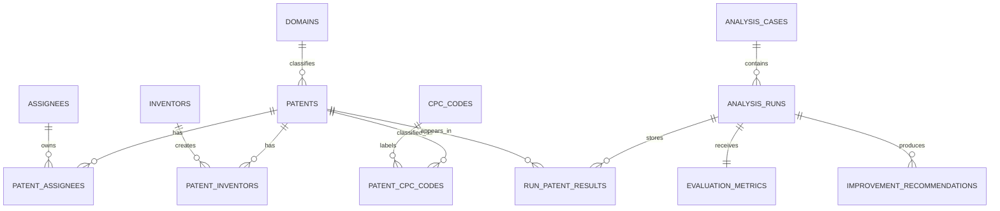

# Relational Design and Normalization

## ER/EER mapping

## Functional dependencies and 3NF

- `patent_id → title, abstract, publication_year, legal_status, citation_count, url, domain_id`.
- `assignee_id → name`, `inventor_id → name`, and `cpc_code → section, description`.
- Composite junction keys determine no non-key attributes: `(patent_id, assignee_id)`, `(patent_id, inventor_id)`, and `(patent_id, cpc_code)`.
- `case_id → owner_user_id, title, idea_text, status`; `run_id → case_id, query_id, gnn_mode, top_k, status, timestamps`.

Each relation has atomic values (1NF), every non-key attribute depends on its
whole key (2NF), and descriptive facts are separated into their own entity
tables so no non-key attribute depends transitively on another non-key
attribute (3NF). Repeating multivalued patent facts are represented by junction
tables rather than comma-separated columns.

## Three-schema architecture

- **External level:** React result pages, saved-case pages, SQL reports, and
  FastAPI contracts expose only task-specific views.
- **Conceptual level:** the ER mapping above defines patents, people,
  classifications, relationships, cases, and runs.
- **Internal level:** InnoDB tables/indexes persist normalized facts; Neo4j is a
  derived graph projection; FAISS stores normalized embedding vectors.

## Relational algebra examples

- Selection/projection: `π patent_id,title (σ domain='AI' ∧ year≥2020 (PATENTS ⋈ DOMAINS))`.
- Assignee count: `γ assignee_id,name; count(patent_id)→n (ASSIGNEES ⋈ PATENT_ASSIGNEES)`.
- Patent/CPC join: `PATENTS ⋈ PATENT_CPC_CODES ⋈ CPC_CODES`.
- Division-style query: `(ASSIGNEE_CPC ÷ REQUIRED_SECTIONS)` returns assignees
  represented in every required CPC section; SQL query Q5 implements it with
  `GROUP BY` and `HAVING COUNT(DISTINCT ...)`.
